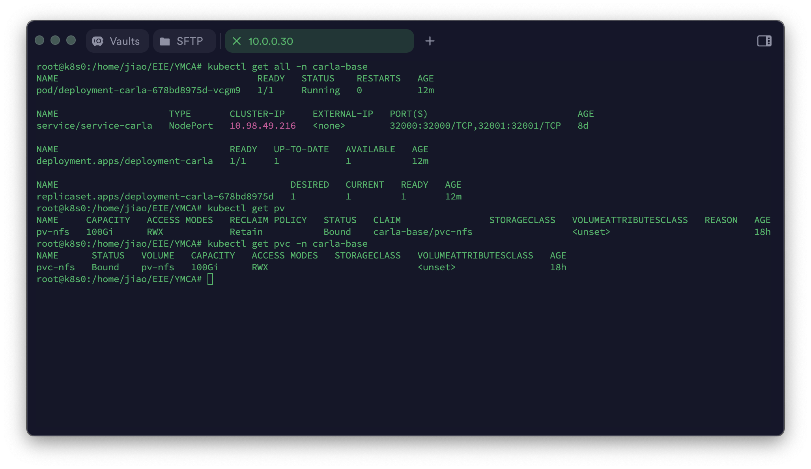

* [遇事不决，先看文档](https://carla.readthedocs.io/en/0.9.15/)

* 如果外部做了端口映射，carla本身也需要修改端口，详见：[Command-line options](https://carla.readthedocs.io/en/latest/start_quickstart/#command-line-options)

* 部署 nfs

    1. `kubectl apply -f persistentvolume-nfs.yaml` pv-nfs

    2. `kubectl apply -f persistentvolumeclaim-nfs.yaml` pvc-nfs

* 部署 carla
    
    1. `kubectl apply -f deployment-carla.yaml` deployment-carla

    2. `kubectl apply -f service-carla.yaml` service-carla

* 部署效果：

    

* 1 scene n test

    1. `kubectl create -f job-carla-1sNt.yaml` job-carla-1sNt

* 单独启动 carla

    1. `sudo docker run --rm --privileged --gpus all --net=host carlasim/carla:0.9.15 /bin/bash ./CarlaUE4.sh -RenderOffScreen`

* SceneGenerator 测试场景及打包

    1. 修改 `scene.json` 及 `scene_generator.py` 创建你喜欢的场景

    2. 运行 `python3 generator.py 10.0.0.31 2000 scene.json` 看看效果

    3. 打包 `sudo docker build -t dxlcq/scene1 .`

    4. 测一测 `sudo docker run --rm scene1 10.0.0.30 32000 scenex.json`

    5. 推送

* `tool/` 目录中有一些 `py api`

    * `get_world.py` 切换地图，获取当前地图的信息，并且保存照片到 `world.png`

* scheduling

    * 测试你写的调度器代码 `go test -v gpuscheduling_test.go`

